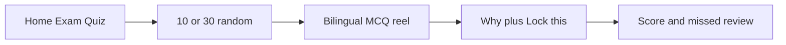

# Practice Question Bank Plan

Implement this plan in a new conversation. Do not push. Commit only if asked. Learners will study from this bank: **source fidelity and educational truth are not the same thing.** Distinguish them before authoring teaching copy.

## Goal

Archive the unshipped 1,148-question Milady Exam Review bank locally (not in git). Rebuild a single bilingual practice pool from the three Word files in `question-bank/Temp`. Reuse the exam-quiz reel with **10- or 30-question** random sessions. After each answer (or explicit Skip), show ESL-first **Why / 为什么** and **Lock this / 记重点**. Ship only questions that are transcription-verified, **factually signed off**, review-signed, and not in quarantine.

## Decisions already made (do not revisit)

1. **Do not ship / do not push** the existing Milady Exam Review chapter bank (foundations / nails / comprehensive). Keep that work on disk, out of the app, out of git.
2. **New source of questions:** the three Word files in `vocabulary-next/question-bank/Temp/`. No Foundations vs Nails vs Theory sections — one practice pool.
3. **Staging is source-faithful.** Extract Word stems, choices, and keys exactly. Do not silently rewrite a Word key to match the textbook.
4. **Shipping is educational.** A Word key that conflicts with established fact (or with another Word item / the textbook) is **quarantined** from the learner-facing pool until explicitly approved. Do not author Why / Lock this around a disputed key.
5. **Omit unrecoverable items.** Do not guess missing questions or missing answers.
6. **Quiz modes:** Quick practice = **10 random**; Practice set = **30 random**. No “all questions” mode. No duplicate IDs inside a session. Exact session size unless the approved pool is smaller than the mode.
7. **Teaching copy is ESL-first**, not clever mnemonics. No puns, rhymes, or made-up acronyms.
8. **Explanations were deferred** in the original exam-quiz plan (`docs/exam-quiz-reel-plan.md`) because that bank had no explanation field. This pool authors them only for **approved, non-quarantined** items.
9. **Deploy validation never requires local Word/PDF files.** Vercel / a clean checkout runs `validate:release` only. Source transcription verification is a separate **local** command that writes an attestation.

If someone later insists every Word key must ship anyway, call the result **source-faithful**, not “100% accurate,” and still do not write teaching copy that defends a false fact without an explicit product decision.

## Implementation todos

- [ ] Checksum-verify an external archive copy, then move the in-repo 1,148-question bank into a gitignored archive; ignore large PDFs
- [ ] Record a source manifest (filenames, SHA-256, counts, extraction-tool version); keep Word files local/untracked unless a licensing decision says otherwise
- [ ] Commit an **ID map** (`id` → source book + itemRef + sourceHash-at-assignment); parse Temp `.docx` into staging JSON with those IDs and `sources[]`
- [ ] Local `verify:sources`: stem + all source A–D + raw key + normalized key + keyed choice text; write attestation
- [ ] Collapse exact duplicates using the type-specific identity rules; keep `sources[]`; retain variants when choices differ
- [ ] Quarantine disputed keys (starting with comprehensive 115); do not author teaching copy for them
- [ ] Add three plausible wrong choices for open-ended items; tag `choicesOrigin`; shuffle correct letter
- [ ] Author ESL-first bilingual `explanation` + `lockPoint` only for items that will ship with `answerReviewStatus: "pass"`
- [ ] zh-Hans via glossary; schema; `questions.json`; review HTML; discrepancies; **review ledger** with factual sign-off fields
- [ ] `validate:source-audit` (local/staging; quarantines allowed when documented) vs `validate:release` (shipped JSON only; no DOCX required)
- [ ] Wire `validate:release` into app prebuild; it must not fail solely because quarantined items exist in staging/ledger
- [ ] Simplify exam-quiz to 10/30 random; explicit Skip that reveals teaching; collapse unused choices; TTS; missed review; drop chapter pickers

---

## What we are setting aside (not shipping)

The uncommitted Milady **Exam Review** work stays on disk but out of the app and out of git.

**Custody (required before moving files):**

1. Copy `vocabulary-next/question-bank/foundations/`, `nails/`, `comprehensive/`, `review/`, `all-questions.json`, old reports, and the large PDFs to a directory **outside this git worktree**. A gitignored folder inside the repo is not a backup — `git clean -fdX` can delete it.
2. **Checksum-verify the external copy** (SHA-256 of every copied file matches the originals) **before** deleting or moving anything in the worktree.
3. Then move the in-repo copies into `vocabulary-next/question-bank/archive/milady-exam-review-8th/`.
4. Gitignore that archive path, the 101MB textbook PDF, and the Exam Review PDF under `docs/`.

Keep the exam-quiz **reel UI** (already uncommitted: `app/exam-quiz/`, `data/exam-quiz/`, `lib/exam-quiz-reel.ts`). Do not keep Foundations / Nails / Comprehensive chapter pickers. Learners still get 10/30 **random** sessions from the full approved pool; in addition, the mode menu lists **ordered 25-question ranges** per original Word source (Nail Test / Theory Update / Milady Comprehensive) in bank order.

No push. Commit only if asked later.

## Source custody and reproducibility

The three Word files and the textbook PDF are currently **untracked**. They are almost certainly copyrighted exam/textbook material.

**Default (unless Shawn decides otherwise):** do **not** commit the Word files or PDFs. Keep them local.

**Always commit** `vocabulary-next/question-bank/sources/manifest.json` containing:

- exact filename
- SHA-256 of each source file
- byte size
- extracted item counts (staging vs shipped vs quarantined vs omitted)
- extraction script name + version/commit

Also commit `vocabulary-next/question-bank/sources/id-map.json`: stable `id` → `{ book, itemRef, sourceHashAtAssignment }`. Source-derived IDs such as `practice-comprehensive-116` are the default, but the **map is the authority**. If a Word file is intentionally revised (new hash), keep existing IDs; add new map rows for new items; never renumber.

Local extraction/`verify:sources` must fail if a present source file’s hash does not match the manifest. Deploy/`validate:release` does **not** open those files.

## Source files

In `vocabulary-next/question-bank/Temp/`:

| File | Role |
|---|---|
| `NAIL TEST (EN) .docx` | Open-ended “Question? Answer” items (~206) plus numbered fill-ins starting at **3** (~58). One stem has **no answer** (“What should be done to help the polish last longer?”) — omit. Numbered items **1–2** are missing — omit. |
| `NEW UPDATE NAILS THEORY.docx` | 30 multiple-choice items with A–D and Answer letter already in the file. |
| `Theory Nail-Milady Comprehensive - English.docx` | Comprehensive MCQ exam **1 through 192 continuously**, each with four choices and a keyed answer. Answer key has mixed Latin/Cyrillic letters (`А`/`С`) — normalize only when unambiguous, and store **both** the raw key character and the normalized letter. |
| `Milady Standard Nail Technology 8th Edition.pdf` | **Distractor, explanation, terminology, and dispute-checking support only.** Not an answer key. |

**Parser note:** an earlier inventory wrongly reported comprehensive **#116** and **#168** as missing. They are present; the stems have **no space after the period** (`116._______`, `168.Who are…`). Extraction must not require whitespace after `N.`.

Approximate yield (after omit, before exact-duplicate collapse): ~206 open-ended + ~58 numbered fill-ins from NAIL TEST, **30** MCQs from NEW UPDATE, **192** MCQs from Comprehensive.

## Answer-key policy: source-faithful vs educational truth

Preserving a Word key in staging is not the same as teaching it.

**Concrete conflict (must quarantine unless explicitly approved):**

- Comprehensive **115**: stem “______ destroys ALL microbial life”
- Choices: A Sanitization, B Disinfection, C Sterilization, D Cleaning
- Word answer key: **A (Sanitization)**
- Established fact (and this plan’s own infection-control ladder): **sterilization** destroys all microbial life, including spores. Sanitization does not.

Authoring Why / Lock this to “defend A” would teach something false.

**Rules:**

1. Staging records the Word key exactly (`rawKey`, `normalizedKey`, `keyedChoiceText`).
2. A mechanical checker may flag obvious disputes (textbook / other bank items / infection-control ladder). It **cannot** find every scientific conflict. Human **factual review** is required for every shipped answer (see ledger `answerReviewStatus`).
3. Disputed items go to `status: "quarantined"` and **do not enter** `practice/questions.json` until Shawn approves an override in the ledger. Quarantine is a **staging/audit** state. It must not fail `validate:release`.
4. Do **not** silently change the Word key to C. If approved later, either ship source-faithful with a learner-visible caveat (product decision) or omit permanently.
5. Teaching copy is authored **only** for items that will ship with `answerReviewStatus: "pass"`, and it must match the **shipped** correct choice.

Call shipped content **transcription-accurate, fact-signed, and review-gated**. Do not call the whole product “100% accurate” while Word keys can be factually wrong.

## Quiz UX

One pool, no sections. Reuse `vocabulary-next/app/exam-quiz/page.tsx` as **mode → quiz → results**.

- **Quick practice: 10 random** (default).
- **Practice set: 30 random**.
- Session draw: Fisher–Yates over the **approved** pool, unique IDs, length exactly 10 or 30 (or the full approved pool if smaller — do not silently pad).
- No “all questions” mode.

Simplify `data/exam-quiz/catalog.ts`, `types.ts`, and `loadChapter.ts` to a single `loadPracticeQuestions()` that loads only approved shipped questions. Drop `SubjectId` / chapter grouping from results. Keep missed-question list **with** Why + Lock this.



### Skip and reveal (must change the current reel)

Today, reveal depends on `selectedChoiceId`, and skip is recorded only when the card navigates away. That cannot produce a teaching beat.

**Required interaction:**

- Add an explicit **Skip / 跳过** button on unanswered cards.
- Skip marks `skipped: true`, `selectedChoiceId: null`, then **reveals** the correct choice + Why + Lock this on the **same card**.
- **Next / 下一题** (or swipe-next) is enabled only after the card is revealed (answered or skipped). Swiping away unanswered must not silently skip without reveal.
- Back navigation mid-quiz still returns to mode and discards the session (session-only persistence), unchanged.

### Choice list after reveal

Do **not** merely fade wrong choices. After answer or skip, **collapse/unmount** every choice that is neither selected nor correct so Why + Lock this get real vertical space. The choices region already scrolls; fading does not free a phone screen.

**Must test before calling UX done** (width × height viewports, not height-only):

- Long English + long Chinese stems/choices on **320×568**, **375×667**, and **390×844**
- TTS tap targets on question, Why, and Lock this; focus not stolen by swipe
- Back button / `popstate` from quiz
- No duplicate question IDs in a 10- or 30-draw
- Exact session sizes against the approved pool count

## Teaching copy: ESL-first, not clever mnemonics

Puns, acronyms, and “巧记” wordplay are a poor fit. Learners are studying **English exam words** with Chinese as the language they already understand. Extra English jokes are more work, not less. The second field is a **lock point**, not a riddle.

Two separate bilingual fields on every **shipped** question:

- `explanation` — **Why / 为什么.** One or two short, plain-English sentences (everyday words + the one technical term). Chinese line is a full translation, not a summary that drops the term.
- `lockPoint` — **Lock this / 记重点.** One line in a fixed pattern: **English exam term = Chinese meaning. Do not confuse with [nearby trap].**

Example (hyponychium):

- Why: This is the skin under the free edge. It helps seal the nail so germs do not get in.
- Lock this: **hyponychium** = 甲下皮 = under the tip. Not eponychium (cuticle area).

### Allowed lock-point types (no puns)

Use the simplest type that fits; do not mix all of them into one line.

- **Term = meaning + trap** (default): monomer = liquid 单体液. Polymer = powder 聚合物粉.
- **Body map in plain words:** ulna = little-finger side of the forearm. Not radius (thumb side).
- **Number + action:** 90° = shorten/cut. 30° = file/shape.
- **Level ladder** for infection control: clean (lowest) → disinfect → sterilize (kills spores too).
- **Name pieces only when they are transparent:** onycho- = nail, -lysis = loosen → onycholysis. Skip this if the pieces would add more English to learn.

Banned: rhymes, native-speaker puns, made-up acronyms, “clever” English that is harder than the question.

### Plain-English rules (ESL)

- Short sentences. Prefer words like *under, side, kill, soak, powder, liquid* over extra jargon.
- Keep the **exam term in English** in both Why and Lock this. Explain it in Chinese immediately beside it.
- Do not introduce a third technical synonym “to help.” One term, one meaning.
- Chinese must stand alone: a learner who only reads the gold line should still get the idea.
- Teaching copy matches the **shipped** correct choice. Never defend a quarantined or disputed key.

Target length: explanation ≤ ~35 English words; lockPoint ≤ ~20. Phone reel.

### When they appear

- Hidden until the learner **answers or taps Skip**.
- After reveal, collapse unused choices; show Why + Lock this; reuse `.qa-answer-reveal`.
- Results / missed list repeats both fields.
- **Both English teaching lines are tappable for TTS** (same as the question).

### Data, QA, and schema

```ts
explanation: { en: string; zh: string }
lockPoint: { en: string; zh: string }
```

Authored fields — the docx transcription checker ignores them. Validators require both languages on shipped items, no placeholders, and that neither field names a different choice as correct.

## Data format

Keep the bilingual MCQ shape (EN + zh-Hans, `choices[]`, `correctChoice`), with a loosened schema.

**IDs** come from the committed **ID map**, not from post-dedup sequence numbers. Source-shaped slugs are fine as the initial assignment (`practice-comprehensive-116`, `practice-theory-update-012`, `practice-nail-test-n003`, `practice-nail-test-q047` for unnumbered NAIL TEST items). If the Word source is later revised, **do not change existing IDs**; update `sourceHashAtAssignment` notes in discrepancies and add map rows only for new items.

When exact duplicates collapse, **keep one canonical id** (prefer the first source in a fixed file order) and retain **all** origins:

```ts
sources: Array<{ book: string; itemRef: string }>
```

Same stem/key but **different choices** are **not** duplicates. Keep them as separate variant IDs (or record a documented merge in discrepancies if a human explicitly chooses one choice set). A single canonical choice list cannot transcription-match both sources.

Other fields:

- `section`: `"practice"`; `chapter`: `0`; `collection`: `"practice-pool"`.
- `choicesOrigin`: `"source"` or `"authored-distractors"`.
- `rawKey` / `normalizedKey` for source MCQs (OCR-safe).
- `status`: `"staging"` | `"quarantined"` | `"approved"` | `"omitted"`.
- `explanation` / `lockPoint`: required on **approved/shipped** items only.
- `verificationWarning` when OCR key letters were normalized but unambiguous.

**Shipped file:** `vocabulary-next/question-bank/practice/questions.json` contains **only** `status: "approved"` records.

Also:

- `vocabulary-next/question-bank/practice/staging.json` — full extract including omitted/quarantined
- `vocabulary-next/question-bank/sources/id-map.json`
- `vocabulary-next/question-bank/sources/manifest.json`
- `vocabulary-next/question-bank/reports/source-attestation.json` — written by local `verify:sources` (optional in git; **not** required at deploy)
- updated `vocabulary-next/question-bank/schema/question-bank.schema.json`
- rewritten scripts under `vocabulary-next/question-bank/scripts/`
- `vocabulary-next/question-bank/glossary/nail-technology-en-zh.json`
- `vocabulary-next/question-bank/reports/discrepancies.md`
- `vocabulary-next/question-bank/reports/review-ledger.json`

### Duplicate identity

- **Open-ended:** exact duplicate iff normalized stem + **verbatim** correct answer. Collapse and merge `sources[]`.
- **Source MCQ:** exact duplicate iff normalized stem + **all ordered choice texts** + keyed choice text. Collapse only then.
- Same stem + same keyed answer + **different distractors:** retain as **variants** (distinct IDs) unless a human merge decision is written in discrepancies.

### contentHash

`contentHash` is SHA-256 of **canonical JSON** (sorted keys, stable Unicode NFC, no insignificant whitespace) over at least:

- `id`, `status`
- `question.en`, `question.zh`
- every choice (`id`, `en`, `zh`) in order
- `correctChoice`
- `explanation.en`, `explanation.zh`, `lockPoint.en`, `lockPoint.zh` (empty/omitted only when not shipped)
- `sources[]` (book + itemRef, stable order)
- `choicesOrigin`

Hash mismatch vs the ledger means the record changed since sign-off.

## Review ledger and split validation

Boolean `verification: { questionChecked: true }` flags can be generated by a script without anyone reading the card. That is not a gate.

Commit a **review ledger** with one row per staging id that is shipped **or** quarantined **or** omitted-with-reason:

- `id`
- `contentHash` (canonical JSON as above)
- `transcriptionStatus`: pass / fail / omitted
- `teachingCopyStatus`: pass / not-applicable / fail
- `disputeStatus`: none / quarantined / approved-override
- `answerReviewStatus`: **pass** / **disputed** / **not-reviewed**
- `authorityRefs`: textbook page, glossary rule id, and/or reviewer note (required when `answerReviewStatus` is pass or disputed)
- `answerReviewer`
- `reviewer` (transcription / teaching-copy sign-off; may be the same person)
- `reviewedAt` (ISO date)

`disputeStatus: "none"` only means the mechanical checker did not flag it. It does **not** prove a human checked the science. **Every shipped record requires `answerReviewStatus: "pass"`.**

Review HTML is the UI for that pass: EN/ZH, correct choice highlighted, authored vs source choices labeled, Why + Lock this, dispute banner when applicable.

### `validate:source-audit` (local / CI-with-sources)

Validates staging, omissions, quarantines, ID map, manifest, and (when source files are present) that hashes match. Unresolved quarantines are **allowed** when documented (`status: "quarantined"` + ledger `disputeStatus: "quarantined"` + `answerReviewStatus: "disputed"`). Comprehensive **115** must pass this audit without being in `questions.json`.

Does not run on Vercel unless sources are present.

### `verify:sources` (local only)

Opens the Word/PDF files, runs full transcription checks, writes `reports/source-attestation.json` (`sourceHash`, `checkedAt`, `scriptVersion`, pass/fail counts). Not part of app prebuild.

### `validate:release` (app prebuild / Vercel / clean checkout)

Examines **only** records in `practice/questions.json` plus the committed ledger, manifest metadata, and ID map. Must **not** open `.docx`/`.pdf`.

Fail if any shipped record:

- is missing from the ledger
- has `status` other than `"approved"`
- has `answerReviewStatus` other than `"pass"`
- has `teachingCopyStatus` other than `"pass"`
- has `transcriptionStatus` other than `"pass"`
- has unresolved `disputeStatus` (`quarantined` without `approved-override`, or fail)
- has a `contentHash` that does not match the canonical hash of the current JSON record

Quarantined rows that exist only in staging/ledger must **not** fail this command.

Wire `validate:release` into `package.json` prebuild / the existing test scripts. Do not wire `verify:sources` there.

## Accuracy pipeline (double-check, non-negotiable)

Work in stages so authored distractors and teaching copy never get treated as source text.

1. **Extract English only** into staging (stem, A–D or open answer, raw/normalized key, source ref, ID from id-map). No translation, no extra choices, no teaching copy.
2. **Local `verify:sources` — source MCQs:**
   - stem
   - **all four** A–D choice texts
   - raw key character (as in the Word file, including Cyrillic lookalikes)
   - normalized key letter (`А`/`A`, `С`/`C`, etc.)
   - resulting keyed choice text
3. **Local `verify:sources` — open-ended:** stem + correct answer text must normalize-match the Word file. Distractors are excluded from this check.
4. Any miss → omit or fix extraction, never “close enough.” Write attestation.
5. **Duplicate pass** using the type-specific identity rules. Variants stay unless a documented merge exists.
6. **Dispute + factual review:** mechanical flags plus human `answerReviewStatus`. Quarantine disputes. Comprehensive **115** is the first known case.
7. **Authored distractors** only for open-ended items that will ship. Correct choice text stays **verbatim**. Three wrong options in the same category. A distractor must not be an equally valid reading of that stem. Tag `choicesOrigin`. Shuffle the correct letter.
8. **Author Why + Lock this** only for items that will ship with factual pass. Plain English, then Chinese via glossary. No puns.
9. **Translate** question + all choices (glossary first; terms like 甲床 / 单体液 / 消毒 stay consistent).
10. **`validate:source-audit`** then **`validate:release`**. Only the latter is an app prebuild gate.
11. **discrepancies.md:** omitted items, OCR normalizations, disputes/quarantine, duplicate collapses, variant retentions, hash mismatches, ID-map notes when a source hash changes.

The 101MB `Milady Standard Nail Technology 8th Edition.pdf` is support for distractors, teaching copy, and dispute checks — not an answer key.

## App wiring

- Point exam-quiz loader at `practice/questions.json` (approved only).
- Strip subject/chapter screens from `app/exam-quiz/page.tsx`, home card copy in `app/page.tsx`, and nav label in `components/NavigationMenu.tsx`.
- Extend `data/exam-quiz/types.ts` `ExamQuestion` with `explanation` and `lockPoint`.
- Explicit Skip → reveal → Next; collapse unused choices after reveal.
- Keep reel gesture/scoring tests in `lib/exam-quiz-reel.ts`; drop `byChapter` or make it a single bucket.
- Home/nav copy: practice quiz from the new pool, not “Milady chapter exam.”
- Prebuild runs `validate:release` only.

## What accuracy means here

- **Staging** is source-faithful to the Word files (attested locally).
- **Shipped** items are transcription-checked, **fact-signed** (`answerReviewStatus: "pass"`), teaching-copy-signed, and educationally defensible.
- We will not invent answers for missing items.
- We will not silently rewrite a Word key.
- We will not teach a quarantined/false key.
- Distractors and teaching copy cannot steal or contradict the **shipped** correct choice.
- Deploy CI can prove the committed JSON still matches the ledger without having the Word files.

Word files still contain typos and internal conflicts. Those stay in staging/discrepancies until reviewed.

## Existing code to reuse (already uncommitted)

- `vocabulary-next/app/exam-quiz/page.tsx` — reel UI; today reveal requires `selectedChoiceId` and skip happens on navigate-away — both must change
- `vocabulary-next/data/exam-quiz/types.ts`, `catalog.ts`, `loadChapter.ts`
- `vocabulary-next/lib/exam-quiz-reel.ts` + `lib/exam-quiz-reel.test.mjs`
- `vocabulary-next/question-bank/schema/question-bank.schema.json`
- `vocabulary-next/question-bank/scripts/validate-question-bank.js`, `build-question-bank.js`, `verify-source-transcription.py` — split into source-audit / release / local verify:sources
- `vocabulary-next/docs/exam-quiz-reel-plan.md` — original reel plan; explanations were explicitly omitted in v1

## How to start the next conversation

Point the new agent at this file:

`vocabulary-next/docs/practice-question-bank-plan.md`

Ask it to implement the plan. Do not push. Commit only if asked.
